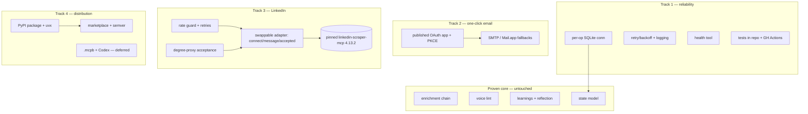
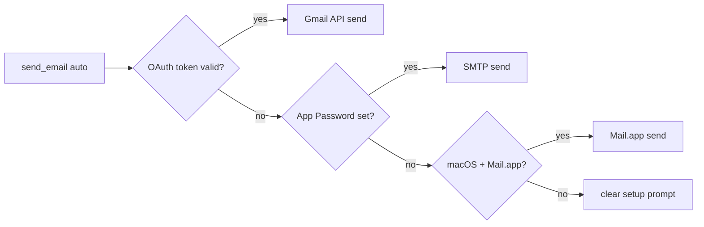
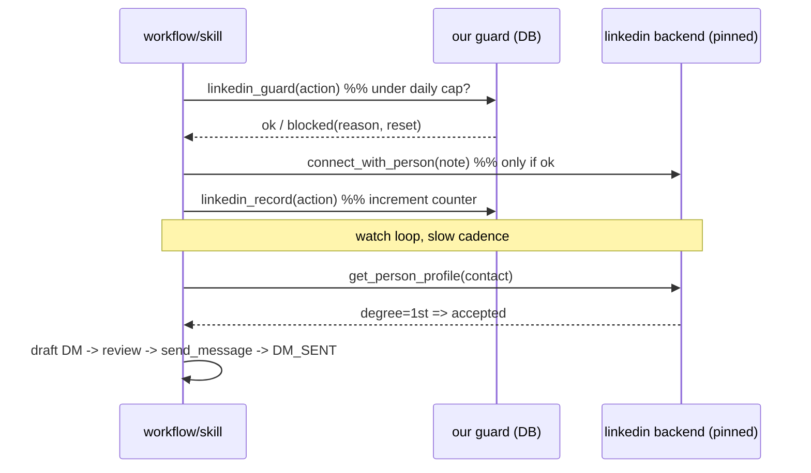

# feat: Productionize job-hunter into a shippable product

> Take the working prototype (enrichment + voice + self-evolving learnings + Mail.app send, all live-tested) to a product anyone can install in one step and use with the least friction — one-click email, packaged distribution, a production-grade-but-honest LinkedIn layer, and reliability hardening across the board.

**Target repo:** `job-hunter`. Paths are repo-relative.

---

## Summary

The prototype works. This plan makes it *shippable*: a product a stranger installs and uses without hand-holding, that doesn't fall over under normal use, and whose one genuinely-fragile part (LinkedIn) fails gracefully and is cheap to swap.

Four tracks:
1. **Reliability hardening** — fix the single shared SQLite connection (the one real correctness landmine), add retries + structured logging + a health check, and put the tests back in the repo behind CI.
2. **One-click email** — a single published, Google-verified OAuth app (PKCE installed-app flow) so each user just clicks "Allow". Research corrected the cost: `gmail.send` is a *sensitive* scope → free ~3–5 day review, **no CASA audit**. SMTP App Password + macOS Mail.app stay as fallbacks.
3. **Production LinkedIn layer** — option (b): keep `linkedin-scraper-mcp` as a *pinned* dependency, behind our own swappable `connect / message / accepted` adapter that owns the rate-limit guard (generous, configurable), retries, acceptance detection, and error surfacing. Swap the backend later without touching the workflow.
4. **Distribution** — package the server to PyPI so Claude Code launches it via `uvx` (zero manual install); publishable marketplace + semver releases. `.mcpb` (Claude app) and Codex snippet are planned but deferred.

Plus a comprehensive `SPEC.md` documenting the whole design, the why, and the philosophy.

---

## Problem Frame

The prototype is a personal tool that happens to work on the author's machine: tests are gitignored, the DB uses one shared SQLite connection that breaks under concurrent tool dispatch, email "just works" because the author's Mac has Mail.app signed in, and LinkedIn rides an unpinned `@latest` dependency. None of that survives contact with "anyone, any app."

The gap to **product** is four specific things: (1) it must not corrupt state or crash under normal concurrent use, (2) a non-author user must be able to send email without the author's Mac, (3) installation must not require manually managing Python and dependencies, and (4) the LinkedIn automation — which the user explicitly requires — must be reliable enough to ship and honest about its limits.

This plan does **not** re-architect the working core (enrichment chain, voice lint, learnings/reflection). That's proven; touching it adds risk for no gain.

---

## Requirements

- **R1 — Concurrency-safe state.** The MCP server must handle concurrent tool calls without `check_same_thread` crashes or interleaved-write corruption.
- **R2 — Resilience.** External calls (Hunter, OAuth, LinkedIn backend) retry transient failures with backoff, surface terminal failures clearly, and never hang indefinitely.
- **R3 — Observability.** Structured logging with secret redaction; a `health` tool/command that reports DB, credentials, and backend reachability.
- **R4 — Tests in repo + CI.** Tests tracked in the repo; GitHub Actions runs `pytest` on push/PR.
- **R5 — One-click email.** A published OAuth app lets any user authorize Gmail send with a single "Allow"; token in OS keychain; works on any OS and Workspace/edu accounts. SMTP + Mail.app remain fallbacks.
- **R6 — OAuth publishing path.** A documented, repeatable runbook to take the OAuth app through Google's sensitive-scope verification, and code that ships the `client_id` safely (PKCE; installed-app `client_secret` treated as public).
- **R7 — Production LinkedIn.** Connect / message / detect-acceptance work reliably behind a swappable adapter with a generous configurable rate guard, retries, and clear failure messages; the backend dependency is version-pinned.
- **R8 — Zero-install distribution.** Claude Code installs the plugin and the server launches via `uvx` from PyPI; no manual `pip install`.
- **R9 — Releasable.** Semantic-versioned releases, a publishable marketplace entry, install docs.
- **R10 — SPEC.md.** A complete design document: architecture, every component, the why behind each decision, and the philosophy.
- **R11 — Keep the philosophy.** Lightweight, token-lean, trust-the-model, self-evolving — unchanged from `CLAUDE.md`.

---

## Key Technical Decisions

### KTD1 — Connection-per-operation, not one shared connection
Replace the single module-level `_conn` with a small helper that opens a short-lived SQLite connection per tool call (WAL already enabled, so concurrent readers/writers coexist), or a thread-local connection. **Why:** the review flagged the shared `_conn` as the top concurrency risk — `sqlite3` connections default to `check_same_thread=True`, and FastMCP can dispatch tools on worker threads. Per-op connections are the simplest correct fix and keep the "DB is the memory" model intact. SQLite + WAL handles this load trivially at single-user scale.

### KTD2 — Published OAuth app, PKCE installed-app flow (email)
One OAuth client (`client_id` shipped in the repo/manifest), Authorization-Code-with-PKCE over a loopback redirect. The installed-app `client_secret` is **public by Google's own design** and provides no security, so shipping it is acceptable; PKCE carries the security. **Why:** research corrected the cost model — `gmail.send` is *sensitive*, so publishing needs domain verification + brand review + a demo video + a ~3–5 day Google review, and **no CASA third-party audit** (that's only for restricted scopes). This makes one-click OAuth genuinely shippable. Token stored in OS keychain.

### KTD3 — Sequence around Google review; fallbacks day one
The Google verification is an **external dependency the author owns**, not something code executes. So: ship with **SMTP App Password + Mail.app working from day one** (already built), and flip the default to one-click OAuth once verification clears. Until then OAuth runs in Testing mode (100 users, 7-day token expiry) for the author/beta only. **Why:** decouples launch from Google's queue; nobody is blocked.

### KTD4 — LinkedIn: pinned dependency behind a swappable adapter (option b)
Keep `linkedin-scraper-mcp` (PyPI `linkedin-scraper-mcp`, **pinned to 4.13.2**, Patchright stealth, session-cookie auth). Our server owns a thin adapter contract — `connect / message / accepted` — that holds the rate-limit guard, retries, acceptance detection, and error normalization. The workflow only ever speaks the adapter's language. **Why:** lightest maintenance now (upstream eats LinkedIn-change fixes), no lock-in (swap the backend to a fork or own Playwright module later without touching the workflow), and the *production-grade behavior is ours* regardless of backend. Pinning (not `@latest`) is mandatory given the Beta status and fragile connect/message tools.

### KTD5 — Acceptance detection via profile-degree proxy
There is no "list accepted invitations" tool upstream. Detect acceptance by calling `get_person_profile` on a SENT contact and reading connection degree — **1st = accepted**. The `watch` step uses this. **Why:** it's the only reliable signal the backend exposes; it's cheap (one call per awaiting contact) and good enough for a slow watch cadence.

### KTD6 — Generous, configurable rate guard (not a tight cap)
The upstream README reports normal-usage rarely triggers flags/bans. So the guard defaults **generous** (e.g. ~40 connects/day, configurable via `userConfig`), enforced as a soft daily counter in our DB with clear messaging when hit — a safety rail, not a strict ToS limit. **Why:** the user explicitly wants generous limits backed by the tool's clean track record; still bounded so a runaway loop can't blast hundreds.

### KTD7 — Ship to PyPI, launch via `uvx`
Package `outreach-mcp` as a PyPI distribution with a `[project.scripts]` console entry; `.mcp.json` launches `uvx outreach-mcp==<pinned>`. **Why:** zero manual install for users (uv resolves deps on first run), matches how the LinkedIn server already ships, and the same PyPI package later backs the `.mcpb` Claude-app bundle (`server.type: uv`).

### KTD8 — Retries + redacted structured logging, stdlib only
Add a tiny retry/backoff helper around external HTTP and a stdlib `logging` setup that redacts secrets (httpx URL logging already suppressed). No new heavy deps. **Why:** production reliability without bloat; keeps the "lightweight" mandate.

---

## High-Level Technical Design

### Productionization map (what changes vs. what stays)

### Email send resolution (after this plan)

### LinkedIn lifecycle with the adapter + guard

---

## Implementation Units

Grouped into five phases. SPEC.md is U1 so the design doc is written with full context before code churns it.

### Phase A — Spec & reliability foundation

### U1. SPEC.md — the full design document
- **Goal:** A complete, durable `SPEC.md`: architecture, every component and why it exists, the data model, the four external integrations, the self-evolving layer, the safety rails, the philosophy, and the production decisions in this plan.
- **Requirements:** R10, R11.
- **Dependencies:** none.
- **Files:** `SPEC.md`.
- **Approach:** Synthesize `CLAUDE.md` (philosophy), the original plan, and this plan into one authoritative spec. Sections: Problem & philosophy → Architecture (thin skills + agents + MCP server) → Data model (tables, lifecycle states) → Integrations (Hunter/Apollo/ContactOut/Lemlist, email channels, LinkedIn adapter) → Self-evolving learnings/reflection → Safety rails → Distribution → Open risks. Explain *why* at each decision, not just *what*.
- **Patterns to follow:** `CLAUDE.md` voice and the decision-with-rationale style of this plan.
- **Test scenarios:** `Test expectation: none -- documentation`. Verification is editorial: a new contributor can understand the whole system from SPEC.md alone.
- **Verification:** SPEC.md covers all 35 tools' purposes, all lifecycle states, all integrations, and the philosophy, with rationale throughout.

### U2. Concurrency-safe SQLite access
- **Goal:** Remove the single shared `_conn`; make every tool use a safe short-lived/thread-local connection.
- **Requirements:** R1.
- **Dependencies:** none.
- **Files:** `servers/outreach-mcp/store.py`, `servers/outreach-mcp/server.py`, `tests/test_concurrency.py`.
- **Approach:** Introduce a `with store.session() as conn:` context (or thread-local) opening a per-call connection (WAL already on). Refactor tools to use it instead of module-level `_conn`. Keep helper signatures (`state.*`, `credits.*`, etc. already take `conn`) — only the server wiring changes.
- **Execution note:** Characterization-first — capture current single-thread behavior with the existing suite before refactoring; it must stay green.
- **Test scenarios:**
  - Happy: a tool call opens, uses, and closes a connection; state persists.
  - Concurrency: N threads calling state-writing tools concurrently all succeed; final state is consistent (no lost writes, no `ProgrammingError`).
  - Edge: a read during a concurrent write returns committed data (WAL), not an error.
  - Integration: the full enrich→draft→send path still passes end to end.
- **Verification:** concurrent tool calls don't raise thread errors or corrupt state; existing 49 tests stay green.

### U3. Resilience: retries, structured logging, health check
- **Goal:** Transient-failure retries, redacted structured logging, and a `health` tool.
- **Requirements:** R2, R3.
- **Dependencies:** U2.
- **Files:** `servers/outreach-mcp/resilience.py`, `servers/outreach-mcp/server.py`, `servers/outreach-mcp/integrations/hunter.py` (+ other integrations), `tests/test_resilience.py`.
- **Approach:** A small `retry(fn, attempts, backoff, retry_on)` helper wrapping external HTTP (429/5xx/timeout → retry with jittered backoff; 402/403 → no retry). A `logging` setup that redacts known secret patterns (keys, tokens, cookies). A `health()` MCP tool returning DB-writable, which credentials are present, and backend reachability (no secrets in output).
- **Test scenarios:**
  - Retry succeeds on the 2nd attempt after one simulated 503; stops after max attempts.
  - 402/403 is not retried (fast-fail to the credit/exhaustion path).
  - Log redaction: a record containing an api key/cookie is emitted with the secret masked.
  - `health()` reports DB ok + present-credentials (names only, never values) + a backend ping result.
  - Edge: `health()` with no credentials configured returns a clear "not configured" status, not an error.
- **Verification:** transient errors recover; terminal errors surface clearly; logs never contain raw secrets; `health()` gives an at-a-glance readiness picture.

### U3b. Tests back in repo + GitHub Actions CI
- **Goal:** Track tests in the repo and run them on push/PR.
- **Requirements:** R4.
- **Dependencies:** none.
- **Files:** `.gitignore` (un-ignore `tests/`), `.github/workflows/ci.yml`, `pyproject.toml` (test deps/markers).
- **Approach:** Remove the `tests/` ignore, commit the suite, add a CI workflow installing deps and running `pytest` on 3.12+. Network-touching tests stay mocked (already are) so CI is hermetic.
- **Test scenarios:** `Test expectation: none -- CI config`; verification is that the workflow runs green on a push.
- **Verification:** CI badge green; `pytest` runs in Actions on every push/PR.

### Phase B — One-click email

### U4. Published OAuth app: PKCE installed-app flow
- **Goal:** One-click Gmail authorization for any user via a shipped OAuth client.
- **Requirements:** R5.
- **Dependencies:** U2.
- **Files:** `servers/outreach-mcp/integrations/gmail.py`, `servers/outreach-mcp/oauth_client.json` (public client_id), `tests/test_gmail_oauth.py`.
- **Approach:** Authorization-Code-with-PKCE over loopback (`127.0.0.1:<port>`), using the shipped `client_id`; treat `client_secret` as public per Google's installed-app guidance. On success, store the refresh/access token in the OS keychain (existing pattern). `send_email` channel `auto` prefers a valid OAuth token, then SMTP, then Mail.app (existing fallback chain). Setup becomes: open browser → "Allow" → done.
- **Patterns to follow:** existing `gmail.py` keychain/token handling; `google-auth-oauthlib` `InstalledAppFlow` with PKCE.
- **Test scenarios:**
  - Token-build + keychain round-trip (mock the flow): a stored token is loaded and refreshed without re-consent.
  - `auto` channel resolves to gmail when a valid token exists, else falls back (existing tests extended).
  - Expired refresh token (Testing-mode) → clear re-auth prompt, no crash.
  - Header/MIME correctness reused from existing `_raw` (UTF-8, CRLF-stripped).
  - Edge: user cancels consent → clean error, no partial token stored.
- **Verification:** a fresh user authorizes with one "Allow" and sends; token persists in keychain; fallbacks intact.

### U5. OAuth publishing runbook + client_id shipping
- **Goal:** A repeatable path to get the OAuth app verified, and safe shipping of the public client.
- **Requirements:** R6.
- **Dependencies:** U4.
- **Files:** `docs/oauth-publishing-runbook.md`, `PRIVACY.md`, `SPEC.md` (link).
- **Approach:** Document the checklist: configure consent screen, declare only `gmail.send` (sensitive), host a privacy policy URL, record the demo video, submit for the ~3–5 day review, and the Testing→Production cutover. Note explicitly that this is an author-owned external process (not executed by code) and that fallbacks cover the interim (KTD3). Confirm the shipped `client_id` is non-sensitive; ensure no real secret is committed.
- **Test scenarios:** `Test expectation: none -- runbook/docs`; verification is completeness against Google's sensitive-scope checklist.
- **Verification:** an author following the runbook can submit for verification without guesswork; no secret committed.

### Phase C — Production LinkedIn layer

### U6. Swappable LinkedIn adapter + rate guard
- **Goal:** A `connect / message / accepted` adapter our workflow speaks, owning the guard, retries, and error normalization, with a pinned backend.
- **Requirements:** R7, KTD4/KTD6.
- **Dependencies:** U2, U3.
- **Files:** `.mcp.json` (pin `linkedin-scraper-mcp==4.13.2`), `servers/outreach-mcp/linkedin_adapter.py`, `servers/outreach-mcp/server.py` (guard tools), `servers/outreach-mcp/db/schema.sql` (daily-action counter), `skills/watch/SKILL.md`, `skills/hunt/SKILL.md`, `tests/test_linkedin_guard.py`.
- **Approach:** Our server exposes guard tools — `linkedin_guard(action)` (pre-flight: under today's configurable cap? returns ok/blocked+reset) and `linkedin_record(action)` (increment the daily counter). The skills instruct: always `linkedin_guard` before any `mcp__linkedin__connect_with_person` / `send_message`, then `linkedin_record` after. A documented adapter contract (`connect/message/accepted`) names the backend seam so swapping off `linkedin-scraper-mcp` later means changing only which backend the skill calls + keeping our guard. Default cap generous (~40/day) via `userConfig`.
- **Patterns to follow:** existing `credits` daily-style tracking; existing `linkedin_*` lifecycle tools.
- **Test scenarios:**
  - Guard allows actions under the cap; blocks at the cap with a reset time.
  - `linkedin_record` increments; the counter resets on a new day.
  - Configurable cap honored (override default → new limit applies).
  - Edge: cap of 0 blocks everything with a clear message.
  - Integration: hunt path calls guard before connect, records after; over-cap stops cleanly without a failed backend call.
- **Verification:** no LinkedIn action fires without passing the guard; the daily counter is accurate and resets; cap is configurable.

### U7. Acceptance detection via profile-degree proxy
- **Goal:** Reliable "did they accept?" detection wired into `watch`.
- **Requirements:** R7, KTD5.
- **Dependencies:** U6.
- **Files:** `skills/watch/SKILL.md`, `servers/outreach-mcp/server.py` (helper to record acceptance), `tests/test_watch_acceptance.py`.
- **Approach:** For each SENT contact, `watch` calls `mcp__linkedin__get_person_profile` and reads connection degree; **1st degree = accepted** → `linkedin_accepted(contact_id)` (existing tool surfaces the prepared DM for review). Slow cadence; only checks the awaiting list. Replace the current fuzzy name/inbox heuristic with the degree check as the primary signal.
- **Test scenarios:**
  - Degree `1st` on a SENT contact → transitions to DM_REVIEW, returns prepared DM.
  - Degree `2nd`/`3rd` → stays SENT (not yet accepted).
  - Edge: profile fetch fails for one contact → that one is skipped, others still processed (no crash).
  - Integration: accepted → DM drafted → review → `send_message` → DM_SENT lifecycle completes.
- **Verification:** acceptance is detected from degree, not guesswork; the watch loop advances accepted contacts and leaves the rest.

### Phase D — Distribution

### U8. PyPI package + uvx launch
- **Goal:** Install-free distribution — Claude Code launches the server via `uvx` from PyPI.
- **Requirements:** R8.
- **Dependencies:** U2, U3 (server stable before packaging).
- **Files:** `pyproject.toml`, `servers/outreach-mcp/__init__.py`, `.mcp.json`, `README.md`.
- **Approach:** `pyproject.toml` with `[project.scripts] outreach-mcp = "outreach_mcp.server:main"`, `requires-python >=3.12`, pinned deps. Restructure the server into an importable package with a `main()` entry. `.mcp.json` command becomes `uvx` with `--from outreach-mcp` (or `outreach-mcp==<ver>`). Document the publish step (build + upload).
- **Test scenarios:**
  - `python -m build` produces a wheel; the console entry resolves to `main`.
  - The server starts via the entry point and registers all tools (smoke test).
  - Edge: missing optional API keys → server still boots (existing behavior preserved).
  - `Test expectation: packaging smoke + boot`; full live `uvx` install verified manually once published.
- **Verification:** `uvx`-launched server boots and exposes the tools; `.mcp.json` points at the published package.

### U9. Marketplace polish + semver releases
- **Goal:** A clean, publishable plugin with versioned releases.
- **Requirements:** R9.
- **Dependencies:** U8.
- **Files:** `.claude-plugin/marketplace.json`, `.claude-plugin/plugin.json` (version bump), `CHANGELOG.md`, `README.md`.
- **Approach:** Finalize `marketplace.json` for public install (`/plugin marketplace add oyaah/job-hunter`), align plugin version to a semver release, add a CHANGELOG and install/quickstart docs. Tag a release.
- **Test scenarios:** `Test expectation: none -- packaging/docs`; verification is `claude plugin validate` passing and a clean install from the marketplace entry.
- **Verification:** `claude plugin validate` passes; a fresh install + `/job-hunter:setup` works end to end.

---

## Scope Boundaries

### In scope
Reliability hardening (concurrency, retries, logging, health, CI), one-click published OAuth email with fallbacks, the swappable LinkedIn adapter + guard + degree-acceptance on a pinned backend, PyPI/`uvx` distribution, marketplace + semver, and SPEC.md.

### Deferred to Follow-Up Work
- **`.mcpb` Desktop Extension** for the Claude app (manifest 0.3, `server.type: uv`, same PyPI package) — planned, after Code-first ships.
- **Codex MCP snippet + docs** — server is already portable; mostly a docs unit, deferred.
- **Forking/replacing the LinkedIn backend** (options a/c) — the adapter seam makes this a later swap if upstream breaks; not now.
- Apollo/ContactOut/Lemlist live testing (paid) — fallback chain is built; live-verify when seats exist.

### Outside this product's identity
- Re-architecting the enrichment/voice/learnings core — proven, untouched.
- Auto-apply / bulk blasting — conflicts with the personalized, human-reviewed, rate-guarded identity.
- Promising bulletproof LinkedIn automation — it's intrinsically fragile/ToS-adjacent; the product is honest about graceful degradation.

---

## Risks & Mitigations

| Risk | Impact | Mitigation |
|---|---|---|
| Concurrent tool dispatch corrupts state | Data loss | KTD1 per-op connections + WAL; concurrency test (U2) |
| Google verification delayed/rejected | No one-click email at launch | KTD3 — SMTP/Mail.app fallbacks day one; OAuth flips on when cleared; only `gmail.send` (sensitive, no CASA) keeps review light |
| `linkedin-scraper-mcp` breaks (Beta, fragile tools) | LinkedIn leg down | KTD4 pinned version + swappable adapter (swap backend without workflow change); clear failure surfacing; honest docs |
| LinkedIn account warning/flag | User account risk | KTD6 generous-but-bounded guard; backend uses Patchright stealth; human-paced, reviewed |
| `client_secret` shipped in repo | Perceived secret leak | KTD2 — installed-app secret is public by Google's design; PKCE carries security; document this so it's not mistaken for a real leak |
| uvx first-run slowness / dep resolution | Rough first start | Pin versions; document the one-time cold start |
| Shipping tests re-introduces flakiness in CI | Red CI | Tests are already mock-based/hermetic; no network in CI |

---

## Dependencies / Prerequisites

- **Author-owned external process:** Google OAuth sensitive-scope verification (~3–5 days, free, no CASA), a hosted privacy policy URL, a demo video.
- **Runtime:** Python 3.12+, `uv`/`uvx`, `mcp`, `httpx`, `keyring`, `google-auth-oauthlib`, `linkedin-scraper-mcp==4.13.2`.
- **Publish:** PyPI account (server package), GitHub releases, marketplace entry.

---

## Sources & Research

- Google OAuth: [gmail.send is *sensitive*](https://developers.google.com/workspace/gmail/api/auth/scopes), [sensitive-scope verification ~3–5 days, no CASA](https://developers.google.com/identity/protocols/oauth2/production-readiness/sensitive-scope-verification), [installed-app secret is public / PKCE](https://developers.google.com/identity/protocols/oauth2/native-app), [Testing mode 100 users / 7-day token](https://support.google.com/cloud/answer/15549945).
- Packaging: [pyproject `[project.scripts]`](https://packaging.python.org/en/latest/guides/writing-pyproject-toml/), uvx + `.mcp.json` pattern.
- `.mcpb`: [MCPB manifest 0.3, `server.type: uv`](https://github.com/modelcontextprotocol/mcpb), [Desktop Extensions](https://www.anthropic.com/engineering/desktop-extensions).
- LinkedIn backend: [`linkedin-scraper-mcp` PyPI v4.13.2](https://pypi.org/project/linkedin-scraper-mcp/), [README — Patchright, low ban-risk on normal use, no built-in rate limit](https://github.com/stickerdaniel/linkedin-mcp-server); acceptance via `get_person_profile` degree.

**External research was load-bearing:** it corrected the OAuth cost model (sensitive, not restricted → no CASA), set the `uvx`/`.mcpb` packaging shape, and pinned the exact LinkedIn backend version + acceptance-detection method.
