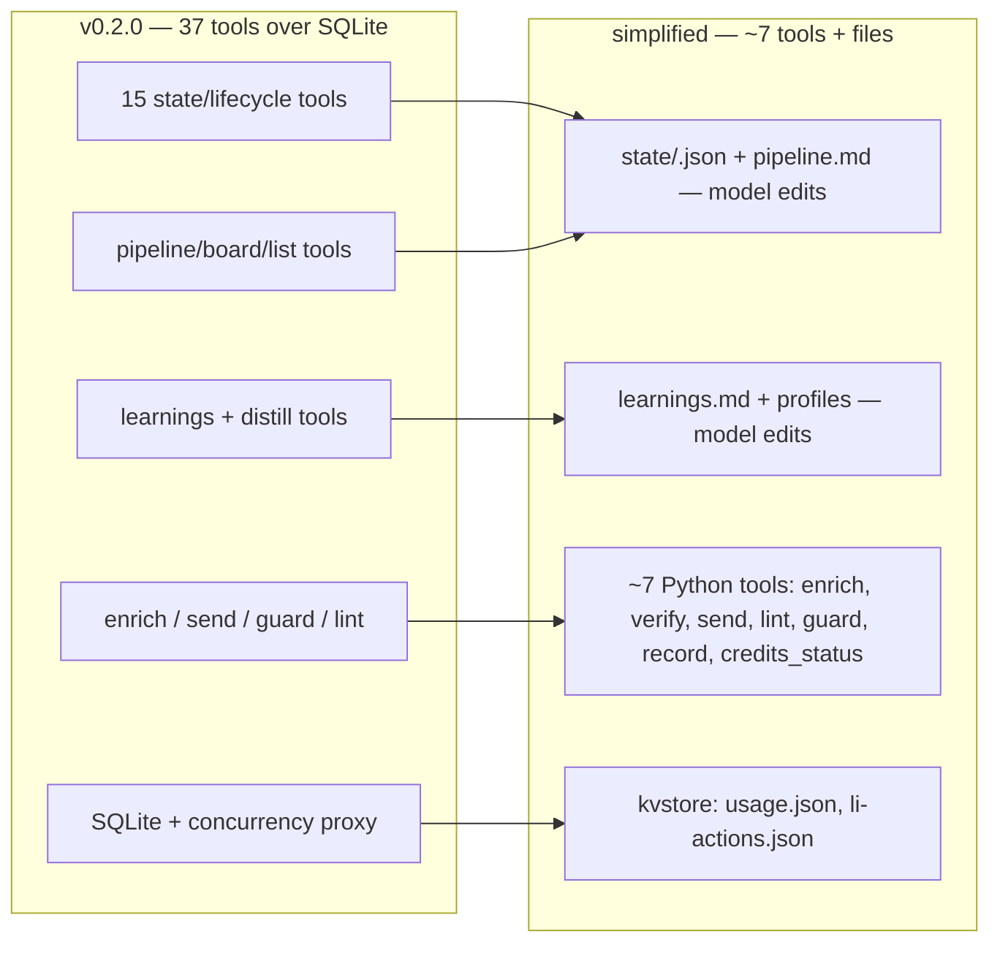
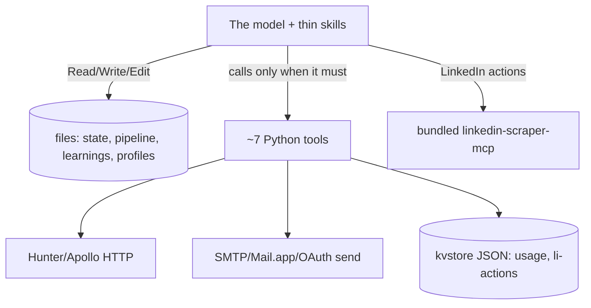

# refactor: Simplify job-hunter — files over DB, ~7 tools not 37

> The best, most-used Claude plugins win by giving the model the right context + only the tools it genuinely needs, then trusting its intelligence. job-hunter grew a 37-tool SQLite MCP server doing work the model can do itself. This collapses it: real code only for what the model *can't* do; everything else becomes markdown/JSON files the model edits and thin skills. Same capabilities, same automation, same safety rails — a fraction of the surface.

**Target repo:** `job-hunter`. Paths repo-relative.

---

## Summary

career-ops (49k⭐) runs its entire pipeline as a markdown file the model reads and writes — no custom state tools. compound-engineering is ~all markdown skills + agents. job-hunter should look like that.

Today: 37 MCP tools over SQLite — state setters, pipeline board, learnings CRUD, reflection bookkeeping, lifecycle transitions — most of it work the model can do with built-in Read/Write/Edit. This refactor keeps **only the load-bearing tools** (things the model truly cannot do: authenticated HTTP to Hunter, gated mail send, OAuth/keychain, the rate-guard counter, deterministic voice lint) and moves **everything else to files**: per-company state, the pipeline board, learnings, the voice/targeting profiles, and reflection. The model drives it all through thin markdown skills.

**Nothing real is lost.** Enrichment, voice-matched drafting, the human review gate, multi-channel send, the full LinkedIn connect→accept→DM automation, and the self-evolving learning loop all stay — they just run on a lighter substrate. Language stays **Python** for the few kept tools (fluent for the model, where the integrations already live); markdown for everything the model drives.

---

## Problem Frame

The 37-tool server is ceremony the thesis rejects. State setters (`set_company_status`, `set_linkedin_status`, `set_message_status`), readers/formatters (`pipeline_board`, `list_pending_messages`, `state_get`), and the learnings/reflection bookkeeping (`learning_record`, `learnings_get`, `reflection_due`, `reflection_apply`, `distill`) all wrap trivial DB reads/writes the model can do directly against a file. The SQLite layer (`store`, `state`, `credits` ledger, `learnings`, `distill`) plus its concurrency proxy and 62 tests exist to support tools that mostly shouldn't exist.

The cost: every capability is locked behind a bespoke tool, the model can't see or reason over the whole state at once (it's behind getters), and the surface is heavy to maintain and explain. The fix is not to delete capability — it's to delete the *code that stands between the model and the work it can already do*.

**What the model genuinely cannot do itself** (these stay as code): make authenticated HTTP calls to Hunter/Apollo; hold an OAuth token / send mail; enforce a deterministic anti-AI lint; keep an honest daily LinkedIn counter that survives across sessions. Everything else is the model + a file.

---

## Requirements

- **R1 — Load-bearing tools only.** Keep Python tools solely for: enrichment HTTP, email send (gated), email verify, the LinkedIn rate-guard counter, deterministic voice lint, and a credit/usage status read. Target ~7 tools, down from 37.
- **R2 — File-based state.** Per-company state, the pipeline board, learnings, and the voice/targeting profiles live as markdown/JSON files the model edits with built-in Read/Write/Edit. No SQLite.
- **R3 — Capabilities preserved.** Enrichment, drafting, review gate, multi-channel send, full LinkedIn automation (connect → watch acceptance → DM), and the self-evolving learning loop all still work.
- **R4 — Safety rails preserved.** Gated send (no send without explicit human approval), never-invent-email (verified-gated), anti-AI voice lint, human-paced LinkedIn (rate guard), secret handling — all intact, even though some move from DB-enforced to skill+tool-enforced.
- **R5 — Self-evolving via files.** Learnings append to a file; reflection is the model rewriting the voice/targeting profile file directly (no distill tool). The loop still tunes to the user over time.
- **R6 — Thin skills.** Skills drive files + the kept tools; no skill embeds logic the model should own. Trust-the-model philosophy from `CLAUDE.md` intact.
- **R7 — Right-sized tests + CI.** New focused tests for the kept tools (enrich chain, send gate, guard, lint); retire the DB-layer tests. CI stays green.
- **R8 — Docs reflect the new shape.** `CLAUDE.md`, `SPEC.md`, `README.md`, `CHANGELOG.md` updated; version bump.

---

## Key Technical Decisions

### KTD1 — State is files, not SQLite (the career-ops pattern)
Per-company state becomes one JSON file per company under the data dir (`state/<company-slug>.json`) plus a human-readable `pipeline.md` board the model maintains. The model reads/writes them with built-in Read/Write/Edit — no `state_get`, no status setters, no `pipeline_board` tool. **Why:** it's the proven high-star pattern (career-ops), it lets the model see and reason over whole state at once instead of through getters, and it deletes ~15 tools + the entire SQLite layer + the concurrency proxy. Single-user, human-paced workload — files are more than enough.

### KTD2 — Keep Python for the few real tools (no rewrite)
The kept tools stay Python. **Why:** the model reads/writes Python most fluently, the integrations (`httpx`, `keyring`, `google-auth`, `smtplib`) already live there, and the existing `integrations/` modules are good. Rewriting in TypeScript or bash would be churn with zero benefit. A tiny bash/grep is allowed only if a trivial check genuinely wants it; none is currently needed.

### KTD3 — The kept tool set (~7)
`enrich_contact` + `verify_email` (Hunter/Apollo/ContactOut chain, verified-gating), `send_email` (SMTP/Mail.app/OAuth, gated), `voice_lint` (deterministic anti-AI check), `linkedin_guard` + `linkedin_record` (daily-counter rate guard), and `credits_status` (Hunter balance + usage read). Optional `gmail_oauth` when the published OAuth flow lands. Everything else is deleted. **Why:** each kept tool does something the model cannot: authenticated HTTP, holding a token + sending, deterministic regex enforcement, honest cross-session counting.

### KTD4 — Persistence for the kept tools = small JSON files, not a DB
The two things that need to persist for the tools — Hunter credit balance and the LinkedIn daily counter — become tiny JSON files (`usage.json`, `li-actions.json`) read/written by a ~20-line `kvstore` helper. **Why:** no SQLite needed at all once state is files; a JSON blob is the simplest durable store for a handful of counters.

### KTD5 — Safety rails move to skill + tool, stay real
- **Gated send:** `send_email` requires an explicit `approved=true` argument the review skill passes *only after* showing the draft and getting human approval; the skill is the gate, the arg is the code check. (Was a DB status claim; the single-user file model makes the atomic-claim race a non-issue.)
- **Never-invent-email:** stays inside `enrich_contact` (gates on verified; guessed surfaced as guessed).
- **Voice lint:** stays a deterministic tool, called by the draft/review skills.
- **LinkedIn human-paced:** `linkedin_guard` stays; the counter is now a JSON file.
**Why:** the rails the user cares about are preserved; only their *enforcement substrate* simplifies, and none of the loosened ones matter at single-user scale.

### KTD6 — Reflection is the model editing a file, not a distill tool
Learnings append to `learnings.md`. When it's grown enough, the `reflect` skill has the model read it and rewrite the compact `voice-profile.md` / `targeting-prefs.md` directly (patch, byte-aware) — exactly what `distill.py` did, but done by the model in the loop with Read/Edit. **Why:** the distilling was always model reasoning; the tool was bookkeeping. Deleting it is pure simplification, and the self-evolving behavior is unchanged.

---

## High-Level Technical Design

### Before → after



### Where work lives now



---

## Output Structure

```
job-hunter/
├── skills/            setup, hunt, target, draft, review, watch, reflect, status  (markdown, drive files + tools)
├── agents/            target-scout, contact-enricher, person-researcher, message-writer  (unchanged)
├── servers/outreach-mcp/
│   ├── server.py      ~7 tools only
│   ├── kvstore.py     tiny JSON file store (usage, li-actions)
│   ├── voice.py       deterministic lint (kept)
│   ├── enrichment.py  chain (kept, now writes result to the caller, not a DB)
│   └── integrations/  hunter, apollo, contactout, gmail, smtp_send, mailapp  (kept)
├── references/        state-file + pipeline templates, voice/targeting templates
└── (deleted: store.py, state.py, credits.py, learnings.py, distill.py, linkedin_adapter→folded, db/, most tests)
```

---

## Implementation Units

### U1. Define the file-based state model + templates
- **Goal:** Establish the markdown/JSON layout the model will drive: per-company state file shape, the `pipeline.md` board, `learnings.md`, and how profiles are stored.
- **Requirements:** R2, R5.
- **Dependencies:** none.
- **Files:** `references/state-file.template.md`, `references/pipeline.template.md`, `references/learnings.template.md`, `CLAUDE.md` (state-is-files section).
- **Approach:** A `state/<company-slug>.json` carries company status, contacts (name/role/email/email_status/hook/research), drafts, and LinkedIn lifecycle per contact. `pipeline.md` is a human-readable board the model keeps in sync. `learnings.md` is append-with-timestamp. Profiles stay as `voice-profile.md` / `targeting-prefs.md` (already files). Document the lifecycle states as values the model writes, not enum tools.
- **Patterns to follow:** career-ops `pipeline.md`; existing `references/*.template.md`.
- **Test scenarios:** `Test expectation: none -- templates/docs`. Verification: an implementer can see exactly what each file holds and how the model updates it.
- **Verification:** templates exist and fully describe the state the deleted DB tables held.

### U2. Slim the MCP server to load-bearing tools
- **Goal:** Reduce `server.py` to ~7 tools; delete the state/lifecycle/learnings/board/distill tools.
- **Requirements:** R1, R3, R4.
- **Dependencies:** U1, U3.
- **Files:** `servers/outreach-mcp/server.py`, `tests/test_send_gate.py`, `tests/test_enrichment.py`.
- **Approach:** Keep `enrich_contact`, `verify_email`, `send_email` (now takes `approved: bool`, refuses unless true), `voice_lint`, `linkedin_guard`, `linkedin_record`, `credits_status`, `health`. Delete the ~29 state/lifecycle/learnings/board/reflection tools. `enrich_contact` returns the verified result to the model (which writes it into the company file) instead of updating a DB row. `send_email` keeps the channel resolution (auto→smtp→mailapp→oauth) and the approval check.
- **Execution note:** Characterization-first on the kept behaviors — port the still-relevant assertions (enrich chain verified-gating, send approval refusal, channel resolution) before deleting the DB-coupled versions.
- **Test scenarios:**
  - `send_email(approved=false)` refuses; `approved=true` resolves a channel and sends (mock).
  - Enrich chain still gates on verified; guessed surfaced as guessed (ported from existing).
  - `voice_lint` flags em/en-dash + banned cadence (ported).
  - Server boots exposing exactly the kept tools; deleted tool names are gone.
  - Edge: `send_email` with no contact email → clear error.
- **Verification:** server boots with ~7 tools; kept capabilities pass; no reference to deleted tools remains.

### U3. Retire SQLite; tiny kvstore for the two counters
- **Goal:** Delete the SQLite layer; back the credit + LinkedIn counters with small JSON files.
- **Requirements:** R1, R2, R4.
- **Dependencies:** U1.
- **Files:** create `servers/outreach-mcp/kvstore.py`; delete `servers/outreach-mcp/store.py`, `state.py`, `credits.py`, `learnings.py`, `distill.py`, `linkedin_adapter.py`, `db/schema.sql`; `tests/test_linkedin_guard.py`, `tests/test_kvstore.py`.
- **Approach:** `kvstore` = read/write a JSON dict at a path under the data dir (atomic write). Credit balance/usage → `usage.json`; LinkedIn daily counts → `li-actions.json`. Fold the guard math (`daily_cap`, `used_today`, `guard`, `record` — generous default 40, `LINKEDIN_DAILY_CAP`) onto kvstore instead of SQLite. The credit fallback-chain provider selection moves into `enrichment.py` reading `usage.json`.
- **Execution note:** Port the guard tests (cap, increment, block-at-cap, separate counters) to the kvstore-backed implementation before deleting the SQLite-backed one.
- **Test scenarios:**
  - kvstore round-trips a dict; concurrent-ish sequential writes don't corrupt (atomic temp-rename).
  - Guard allows under cap, blocks at cap, counts connect/message separately, honors `LINKEDIN_DAILY_CAP` (ported).
  - Credit usage decrement persists across a reopen.
  - Edge: missing file → treated as empty/zero, not an error.
- **Verification:** no SQLite anywhere; counters persist across process restarts via JSON.

### U4. Rewrite skills to drive files + slim tools
- **Goal:** Update every skill to read/write the state files and call only the kept tools.
- **Requirements:** R3, R5, R6.
- **Dependencies:** U1, U2.
- **Files:** `skills/setup/SKILL.md`, `skills/hunt/SKILL.md`, `skills/target/SKILL.md`, `skills/draft/SKILL.md`, `skills/review/SKILL.md`, `skills/watch/SKILL.md`, `skills/reflect/SKILL.md`, `skills/status/SKILL.md`.
- **Approach:** `hunt` drives the per-company files (update status by editing the file, not a tool) and calls enrich/send/guard. `review` shows the draft, gets approval, calls `send_email(approved=true)`, appends the edit-reason to `learnings.md`. `status` reads `pipeline.md`. `reflect` reads `learnings.md` and rewrites the profile file. `watch` checks LinkedIn degree, edits the company file, drafts+sends the DM. LinkedIn automation arc (guard → connect → watch → DM) fully preserved. Keep skills thin: goal + the files + the tools, not choreography.
- **Patterns to follow:** existing thin-skill voice; career-ops file-driven skills.
- **Test scenarios:** `Test expectation: none -- markdown skills`. Verification: each skill references only kept tools + the state files; the full hunt→review→send→LinkedIn→watch→DM arc is expressible end-to-end.
- **Verification:** no skill references a deleted tool; the automation flow is intact in prose.

### U5. Focused tests + CI
- **Goal:** A right-sized suite for the kept tools; CI stays green.
- **Requirements:** R7.
- **Dependencies:** U2, U3.
- **Files:** `tests/test_enrichment.py`, `tests/test_send_gate.py`, `tests/test_linkedin_guard.py`, `tests/test_kvstore.py`, `tests/test_voice.py`; delete `tests/test_state.py`, `tests/test_credits.py`, `tests/test_learnings.py`, `tests/test_distill.py`, `tests/test_concurrency.py`, `tests/test_resilience.py` (resilience helper may stay if still used).
- **Approach:** Keep/port tests that cover the kept tools' real behavior (enrich chain, send gate, guard, lint, kvstore). Delete DB-layer tests. CI workflow unchanged (it just runs `pytest`).
- **Test scenarios:** the suite covers every kept tool's happy + key edge/error path; runs hermetic (no network).
- **Verification:** `pytest` green; suite is small and maps 1:1 to kept tools.

### U6. Update docs + version
- **Goal:** Docs describe the simplified shape; version bump.
- **Requirements:** R8.
- **Dependencies:** U2, U3, U4.
- **Files:** `CLAUDE.md`, `SPEC.md`, `README.md`, `CHANGELOG.md`, `.claude-plugin/plugin.json`, `.claude-plugin/marketplace.json`.
- **Approach:** Rewrite the architecture sections: state-is-files, ~7 tools, model-drives-everything. Keep the philosophy + safety-rail sections (update where enforcement moved). Bump to 0.3.0; CHANGELOG entry framing this as the simplification.
- **Test scenarios:** `Test expectation: none -- docs`. Verification: SPEC/CLAUDE match the built shape; no stale references to SQLite or deleted tools.
- **Verification:** docs accurate to the new architecture; version 0.3.0 across manifests.

---

## Scope Boundaries

### In scope
Collapsing tools to the load-bearing set, moving state/learnings/profiles/board to files, deleting the SQLite layer, rewriting skills to drive files, right-sized tests, doc + version updates. Every capability and safety rail preserved.

### Deferred to Follow-Up Work
- Published Google OAuth one-click flow (still planned; SMTP/Mail.app cover sending now).
- Full PyPI/`uvx` packaging + `.mcpb` bundle.
- Apollo/ContactOut/Lemlist live testing (paid).

### Outside this product's identity
- Dropping any capability or automation — explicitly forbidden by the user; this is a substrate change only.
- Rewriting the kept tools in another language — Python stays.

---

## Risks & Mitigations

| Risk | Impact | Mitigation |
|---|---|---|
| Re-grounding state in files loses a capability | Regression | U2/U4 characterization-first — port kept behaviors before deleting; the file model must hold everything the DB tables did (U1 audit) |
| Gated send weaker without DB claim | Unapproved send | `send_email(approved=...)` arg + review-skill gate; single-user sequential use makes the race moot |
| Model mismanages state files | Inconsistent pipeline | Clear file templates (U1) + thin-skill discipline; files are visible/inspectable, unlike DB rows |
| Counter files lost/corrupted | Guard/credit drift | atomic temp-rename writes; missing file = zero, not error |
| Deleting tests reduces coverage | Hidden breakage | Replace with focused tests mapping 1:1 to kept tools; CI stays green |

---

## Sources & Research

- Prior art (studied earlier this session): [career-ops](https://github.com/santifer/career-ops) — 49k⭐, file-based `pipeline.md` state, no custom state tools; [compound-engineering-plugin](https://github.com/EveryInc/compound-engineering-plugin) — ~38 markdown skills + ~50 agents, minimal bespoke tools. Both validate: give the model context + the few needed tools, let it drive.
- Language: Python kept for the integrations already in `integrations/`; markdown for model-driven surface. No external research was load-bearing for this plan — it's a substrate simplification grounded in the existing codebase + the two prior-art repos.
